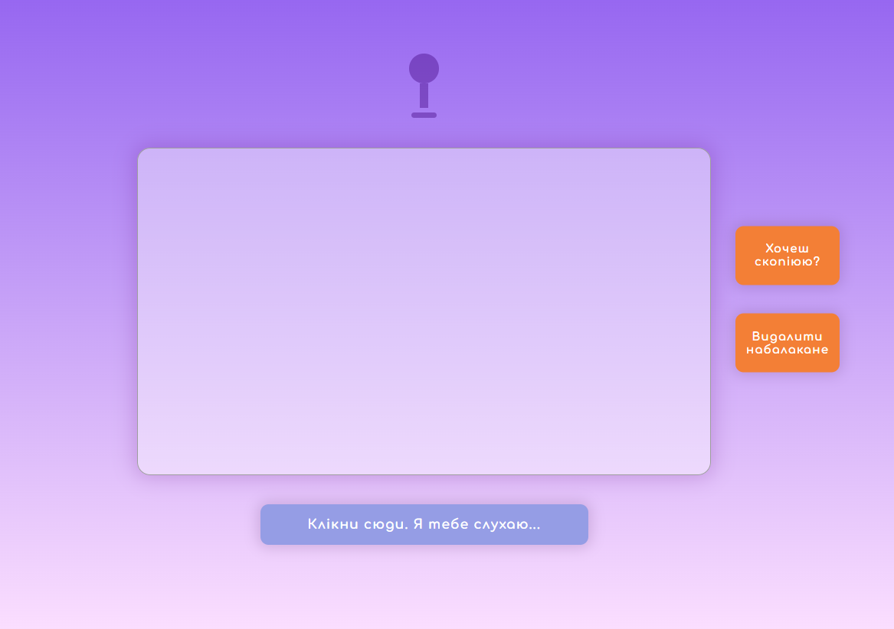

### Voice-to-Text Web App

A responsive, browser-based speech-to-text application built with the Web Speech API and Web Audio API.
Supports continuous dictation, real-time transcription, and clipboard export, with visual feedback driven by live microphone input.

### Screenshot

### Tech stack

- HTML5
- CSS3
- JavaScript (ES6+)
- Web Speech API
- Web Audio API

### Features

🎙 Real-time speech recognition

✍️ Live interim + final transcription

📋 Copy to clipboard

🎨 Visual listening feedback

⚠ Error handling

### Link

- Live Site URL: [ https://voitsekhovska.github.io/voice-to-text-app]( https://voitsekhovska.github.io/voice-to-text-app/)